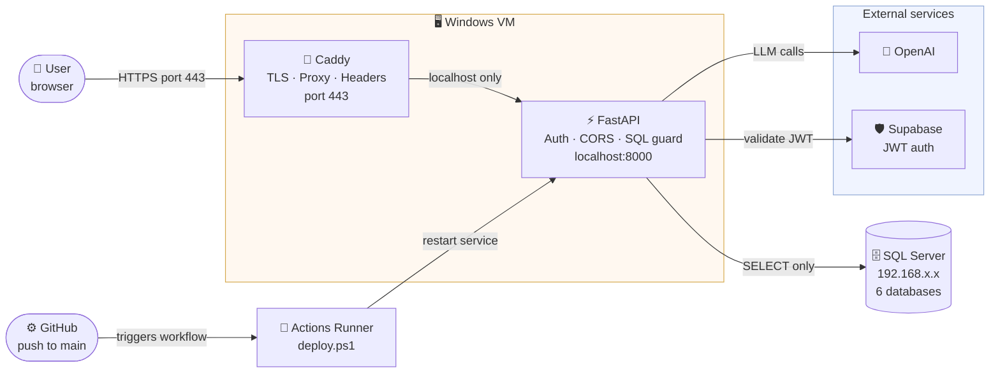
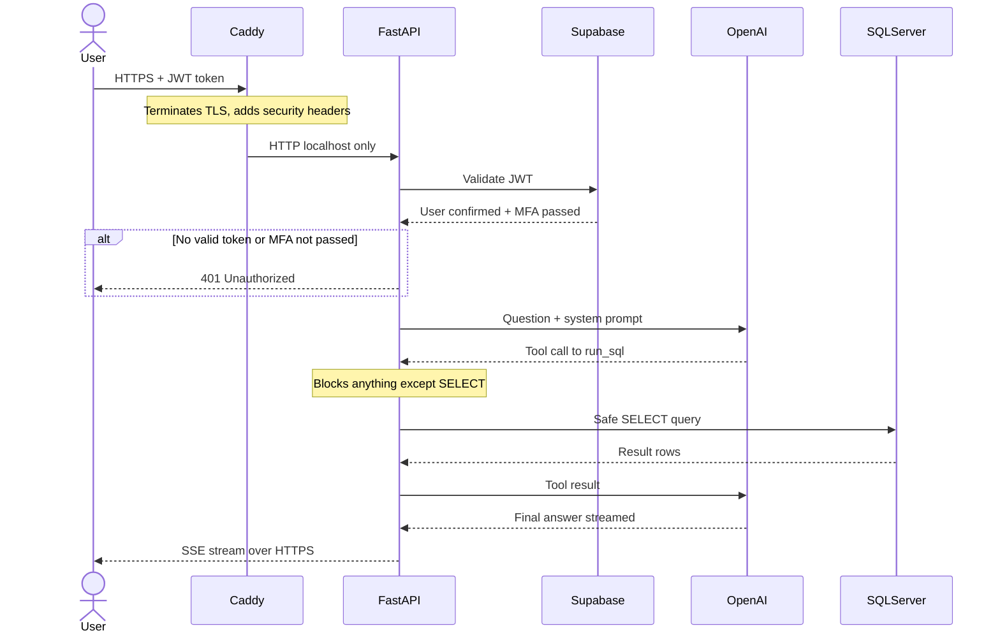
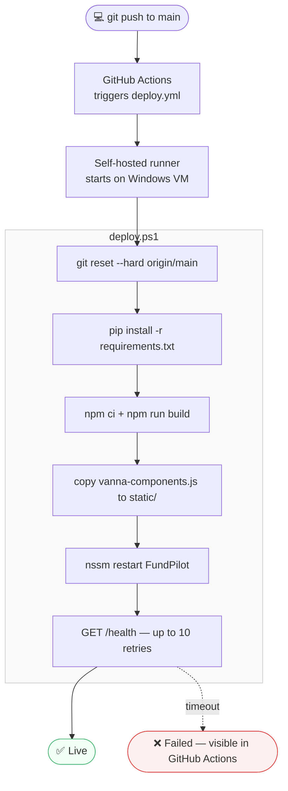
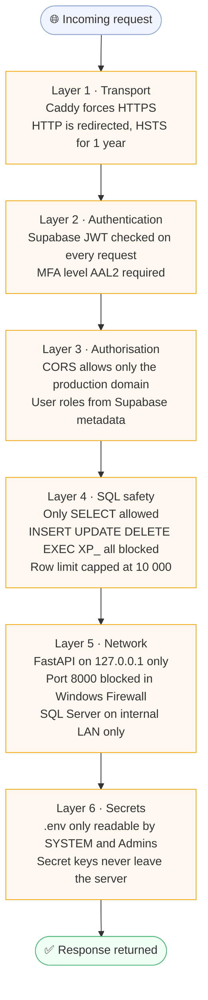

# FundPilot — Architecture & Deployment

## 1. System Architecture

How all the pieces connect — from a user's browser to the SQL Server on the internal network.

---

## 2. What Happens When a User Asks a Question

The full lifecycle of a single chat message.

---

## 3. How a Deploy Works

What happens the moment code is pushed to `main`.

---

## 4. Security Layers

Every request passes through these defences in order.

---

## 5. What Each File Does

| File | When to use | What it does |
|---|---|---|
| `deploy/install.ps1` | **Once** — fresh Windows VM, run as Administrator | Installs NSSM & Caddy, clones the repo, creates Python venv, builds the frontend, registers both as Windows Services, opens firewall ports 80 & 443 |
| `deploy/deploy.ps1` | **Automatically** on every push to `main`, or run manually | Pulls latest code, reinstalls Python deps, rebuilds the JS bundle, copies it to `static/`, restarts the service, verifies `/health` |
| `Caddyfile` | Edit **once** to set your domain, then leave it | Tells Caddy which domain to serve, where to proxy API requests, which security headers to set |
| `.github/workflows/deploy.yml` | Never run manually — GitHub triggers it | Tells GitHub Actions to run `deploy.ps1` on the self-hosted Windows runner on every push to `main` |
